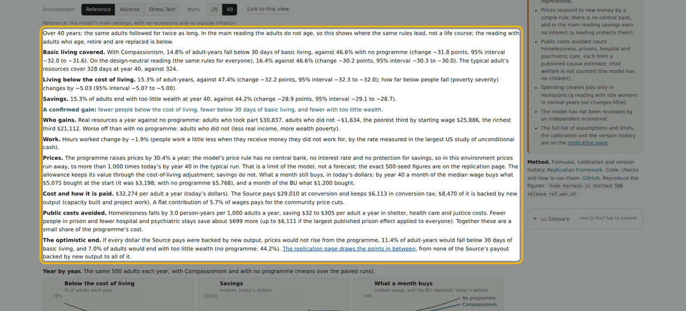
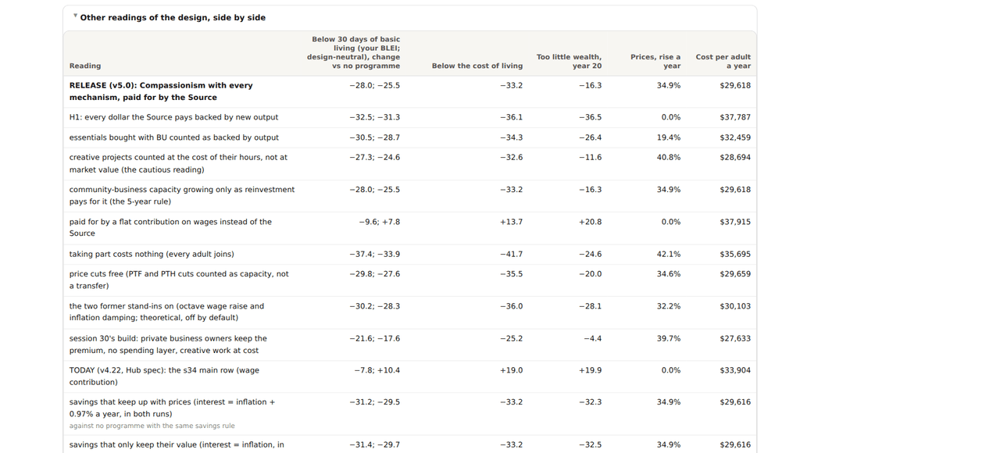
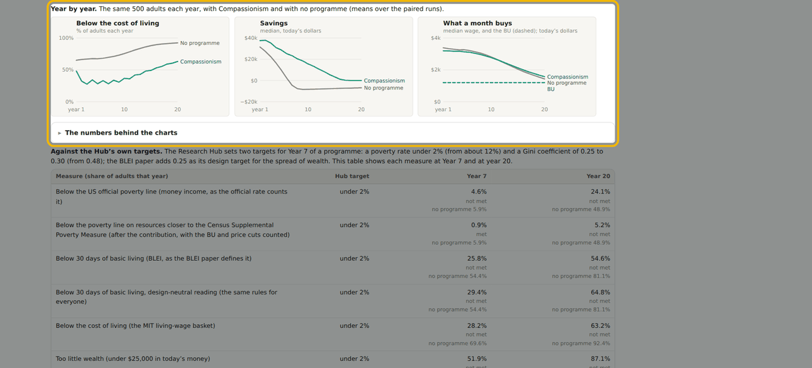
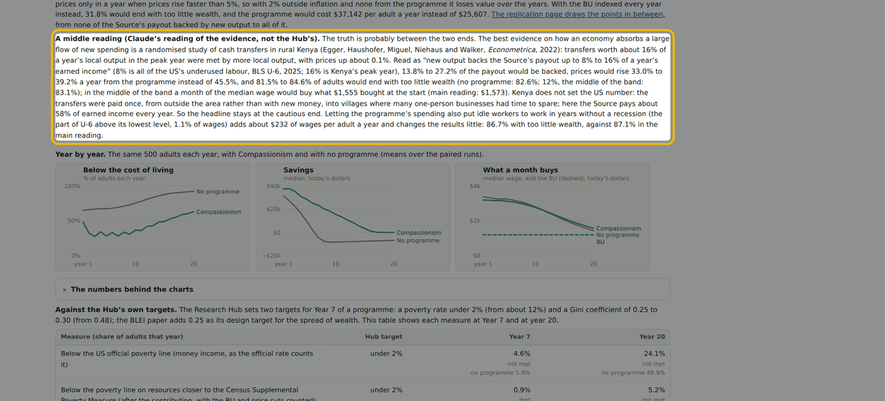
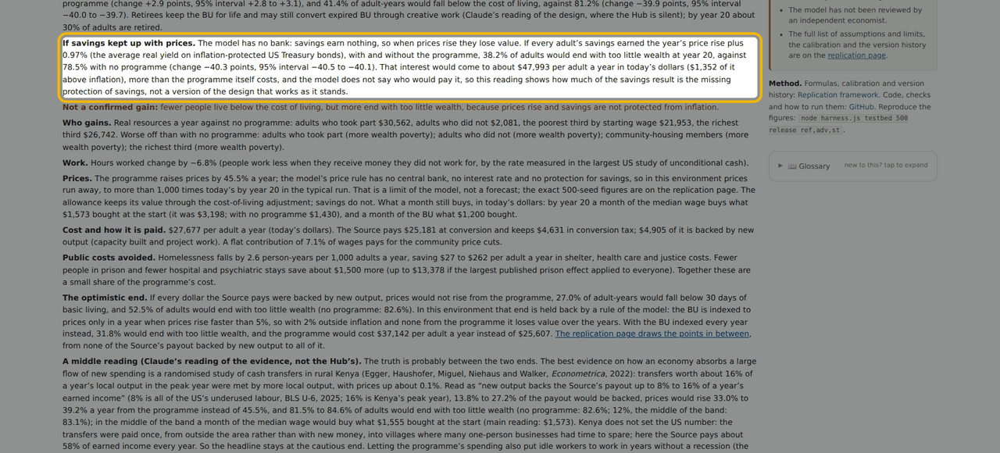
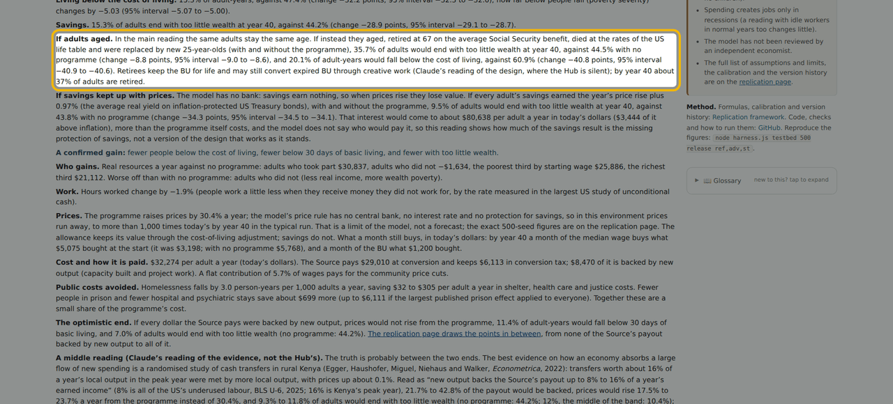
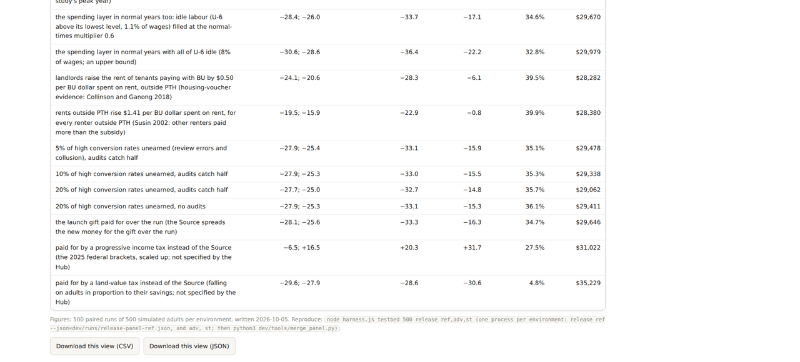
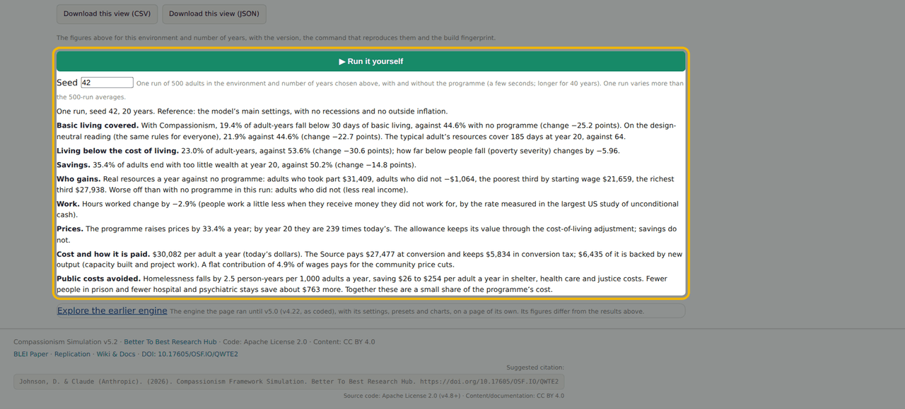
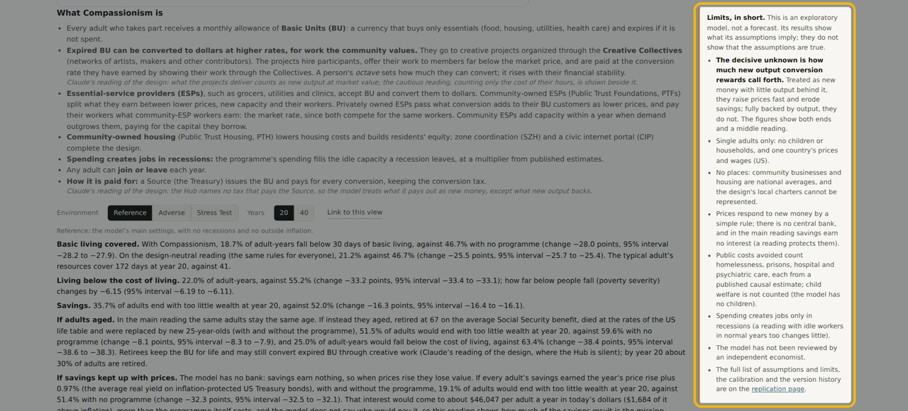
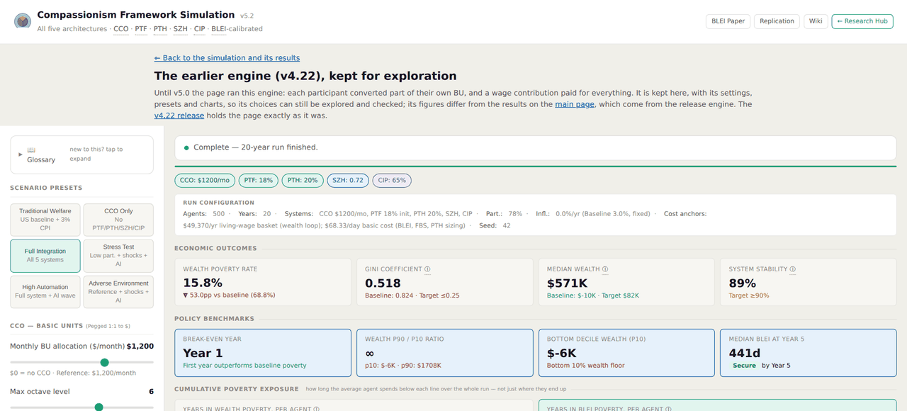

# Walk-through: the Compassionism Framework Simulation (v5.2)

<!-- Written by walkthrough/make_walkthrough.py. Edit the captions there and rebuild; edits here are overwritten. -->

[](https://bettertobest.github.io/compassionism-simulation/walkthrough/walkthrough.mp4)

**[Watch the walk-through](https://bettertobest.github.io/compassionism-simulation/walkthrough/walkthrough.mp4)** (9:04, narrated by a synthetic voice, with captions; [caption file](captions.vtt)). The same tour follows as text, one screenshot per step.

It covers what the page shows, how Compassionism works, what the model finds so far (including where the gain is not confirmed), how to run a scenario, what the model cannot tell you, how to check the work, and how to help. Every figure below is read from the page's own results data when the tour is built (`python3 walkthrough/make_walkthrough.py`; the script is `tour.json`, see [UPDATING.md](UPDATING.md)), so it matches the page it was built from. The figures are results of the model under its stated assumptions, not forecasts.

## 1. What the page is for


The first screen says what the tool is for: to see how Compassionism does at eradicating extreme poverty, and at rewarding participation and contribution.


Duke Johnson wrote the concepts. Claude, an AI model made by Anthropic, engineered the math and code. No independent economist has reviewed the model yet, and the code is open for anyone to check.


The model follows the same 500 simulated adults for 20 years, or for 40, once with Compassionism and once with no programme, in three environments. Figures are averages over 500 paired runs.

## 2. How Compassionism works


Every adult who takes part receives a monthly allowance of Basic Units, or BU: a currency that buys only essentials, and expires if it is not spent. Expired BU can be converted to dollars at higher rates, for work the community values. They go to creative projects organized through the Creative Collectives, networks of artists, makers and other contributors. The projects hire participants, offer their work to members far below the market price, and are paid at the conversion rate they have earned by showing their work through the Collectives. A person's octave sets how much they can convert. Essential-service providers, or ESPs, accept BU and convert them to dollars. Community-owned ESPs split what they earn between lower prices, new capacity and their workers. Privately owned ESPs pass what conversion adds to their BU customers as lower prices, and pay their workers the same market rate. Spending also creates jobs in recessions, and any adult can join or leave each year. A Source, the Treasury, issues the BU and pays for every conversion. Where the Hub is silent, the page labels the choice as Claude's reading of the design.

## 3. What the model finds


At the reference settings, 18.7% of adult-years fall below 30 days of basic living with Compassionism, against 46.7% with no programme. Living below the cost of living falls from 55.2% to 22.0%, and the share with too little wealth at year 20 falls from 52.0% to 35.7%. Adults who take part gain about 30,300 dollars a year in real resources. Adults who do not take part lose about 800 dollars a year. The cost is about 29,600 dollars per adult a year, and prices rise 34.9% a year, because the model treats conversion as new money with little output behind it. If every dollar the Source pays were backed by new output, prices would stay flat and the gains would be larger. The decisive unknown is how much output conversion rewards call forth.


In the Adverse Environment, with recessions and inflation, fewer adults fall below 30 days of basic living: 33.1% against 60.0%. But too little wealth rises from 82.6% to 87.1%.


In the Stress Test it is the same: below 30 days of basic living falls from 60.0% to 54.9%, but too little wealth rises from 82.6% to 90.6%. The gain is not confirmed there, and the page says so.



The Years switch runs the same adults for 40 years instead of 20. They do not age in the model, so this shows where the same rules lead, not a lifetime. At the reference settings the gains grow: 14.8% of adult-years fall below 30 days of basic living, against 46.6%, and too little wealth at year 40 falls from 44.2% to 15.3%. In the Adverse Environment and the Stress Test, too little wealth is still worse with the programme over 40 years: 97.9% against 94.5% in Adverse, as prices keep rising and, in the main reading, savings earn no interest.



Below the results, other readings of the design sit side by side: full backing by output, creative work counted at cost, the earlier engine, and this round's new readings, so you can see how much each choice matters.

## 4. Year by year



Year by year, the same adults each year, with and without the programme. In the Adverse Environment fewer adults live below the cost of living with Compassionism in every year: 63.2% against 92.4% by year 20. Savings fall in both runs: median savings end at -$10 with the programme and -$6,860 without, in today's dollars. What a month buys: a month of the BU keeps its value, $1,200 in today's dollars, because the Hub's rule indexes it in any year prices rise faster than 5%. A month of the median wage falls from $3,200 to $1,570, and to $1,430 with no programme.

## 5. Readings beside the main result



The decisive unknown has a middle reading too, anchored by a study of cash transfers in rural Kenya, where new spending was met by more output with almost no price rise. In the Adverse Environment the middle band brings too little wealth to between 81.5% and 84.6%, against 87.1% as built and 82.6% with no programme. Kenya does not set the US number, so the headline stays at the cautious end.



If savings kept up with prices, with and without the programme, too little wealth in the Adverse Environment would be 38.2%, against 78.5% with no programme. The interest that implies is large, and the model does not say who would pay it.



Over 40 years, if adults aged, retired at 67 on Social Security and were replaced by new 25-year-olds, too little wealth would be 35.7% with the programme, against 44.5% without.



The other readings also hold the tests an economist will ask about: landlords raising rents, mistakes and collusion in reviewing work, and paying with taxes instead of the Source. Rents rising where community housing does not cover demand are the largest of these risks: at the reference settings the drop in too little wealth shrinks from -16.3 to -6.1 points. Community-owned housing is the design's answer to it.

## 6. Run it yourself



Press Run it yourself to run one seed of 500 adults, with and without the programme, in your browser. A single run varies more than the 500-run averages. Enter a seed to repeat a run exactly: the same seed gives the same result.

## 7. What it cannot tell you



What the model cannot tell you: it has single adults only, no children or households, no places, and a simple rule for prices. It is an exploratory model, not a forecast.



The earlier engine, v4.22, now has a page of its own, linked from the front door as Explore the earlier engine, with its settings, presets and charts. Its figures differ from the main results.

## 8. Check the work


The Replication framework page holds the formulas, the calibration, the assumptions and the full version history.


The replication page also checks the no-programme run against US data: poverty rates, income inequality, savings and how long poverty lasts. Where the model differs, it says why, and a reading shows what changing that choice does.

```
git clone https://github.com/BetterToBest/compassionism-simulation
cd compassionism-simulation && npm install
npm test                              # validate, unit and domtest
node harness.js testbed 500 release ref,adv,st   # the page's figures
```

The simulation's page is one HTML file, and the earlier engine has its own. harness.js runs the same engine from the command line; the figures on the page come from node harness.js testbed 500 release ref,adv,st. npm test runs the three checks, validate, unit and domtest, and GitHub runs them on every push.

## 9. Help improve it

Ways to contribute, from [CONTRIBUTING.md](../CONTRIBUTING.md#how-to-contribute): scenario testing (the highest-value contribution), calibration with cited sources, reproducibility testing, model architecture feedback, code, and peer review.

Contributions most wanted: sources for the untested constants, scenario tests from places you know, reproductions, and critiques of the design. Open an issue or a pull request on GitHub. CONTRIBUTING.md explains how.

## Links

- Simulation: https://bettertobest.github.io/compassionism-simulation/
- Code and checks: https://github.com/BetterToBest/compassionism-simulation
- Replication framework: https://bettertobest.github.io/compassionism-simulation/replication.html
- Archive: https://doi.org/10.17605/OSF.IO/QWTE2
