# Walk-through: the Compassionism Framework Simulation (v5.0)

<!-- Written by walkthrough/make_walkthrough.py. Edit the captions there and rebuild; edits here are overwritten. -->

[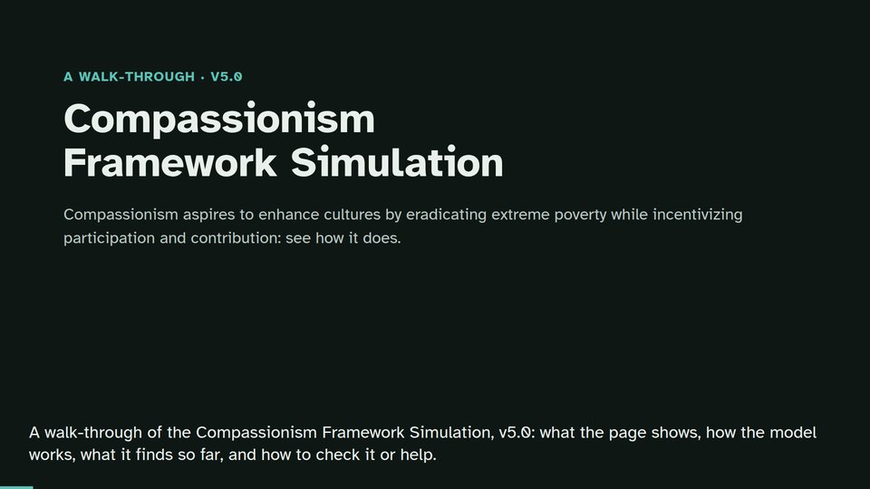](https://bettertobest.github.io/compassionism-simulation/walkthrough/walkthrough.mp4)

**[Watch the walk-through](https://bettertobest.github.io/compassionism-simulation/walkthrough/walkthrough.mp4)** (5:14, narrated by a synthetic voice, with captions; [caption file](captions.vtt)). The same tour follows as text, one screenshot per step.

It covers what the page shows, how Compassionism works, what the model finds so far (including where the gain is not confirmed), how to run a scenario, what the model cannot tell you, how to check the work, and how to help. Every figure below is read from the page's own results data when the tour is built (`python3 walkthrough/make_walkthrough.py`; the script is `tour.json`, see [UPDATING.md](UPDATING.md)), so it matches the page it was built from. The figures are results of the model under its stated assumptions, not forecasts.

## 1. What the page is for

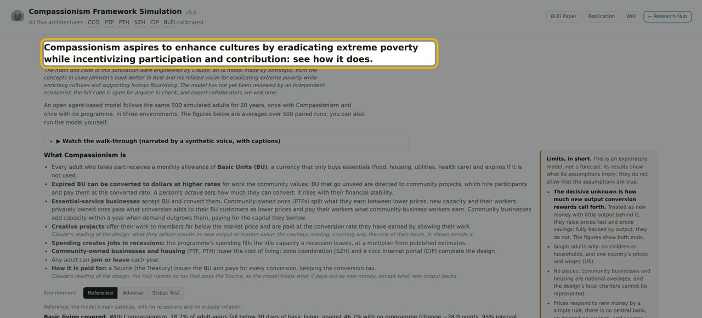

The first screen says what the tool is for: to see how Compassionism does at eradicating extreme poverty, and at rewarding participation and contribution.

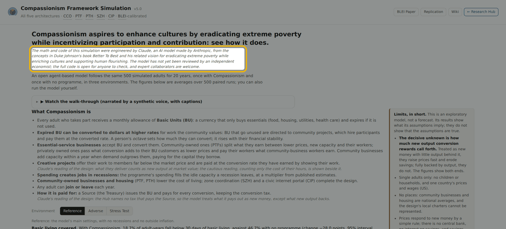

Duke Johnson wrote the concepts. Claude, an AI model made by Anthropic, engineered the math and code. No independent economist has reviewed the model yet, and the code is open for anyone to check.

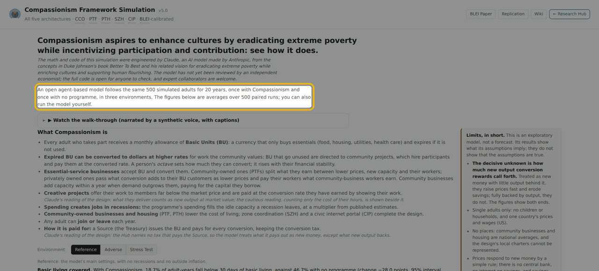

The model follows the same 500 simulated adults for 20 years, once with Compassionism and once with no programme, in three environments. Figures are averages over 500 paired runs.

## 2. How Compassionism works

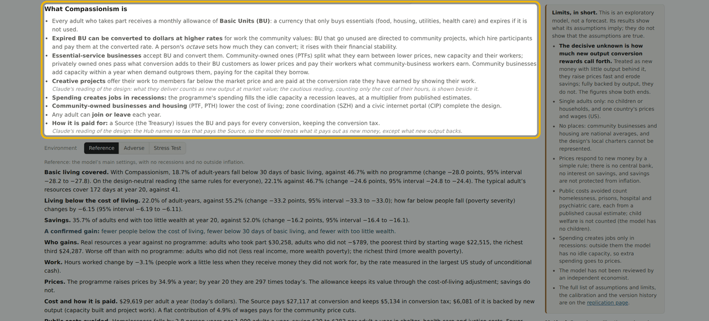

Every adult who takes part receives a monthly allowance of Basic Units, or BU: a currency that only buys essentials, and expires if it is not used. Expired BU can be converted to dollars at higher rates, for work the community values. Unused BU go to community projects, which hire participants and pay them at the converted rate. A person's octave sets how much they can convert; it rises with their financial stability. Essential-service businesses accept BU, and community-owned ones lower prices and add capacity within a year when demand outgrows them. Creative projects offer their work to members far below market price. Spending also creates jobs in recessions. Any adult can join or leave each year. A Source, the Treasury, issues the BU and pays for every conversion. Where the Hub is silent, the page labels the choice as Claude's reading of the design.

## 3. What the model finds

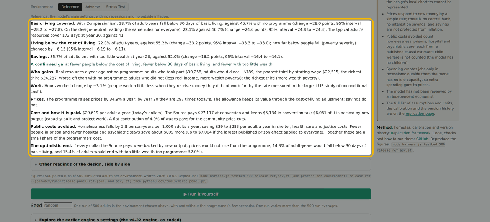

At the reference settings, 18.7% of adult-years fall below 30 days of basic living with Compassionism, against 46.7% with no programme. Living below the cost of living falls from 55.2% to 22.0%, and the share with too little wealth at year 20 falls from 52.0% to 35.7%. Adults who take part gain about 30,300 dollars a year in real resources. Adults who do not take part lose about 800 dollars a year. The cost is about 29,600 dollars per adult a year, and prices rise 34.9% a year, because the model treats conversion as new money with little output behind it. If every dollar the Source pays were backed by new output, prices would stay flat and the gains would be larger. The decisive unknown is how much output conversion rewards call forth.

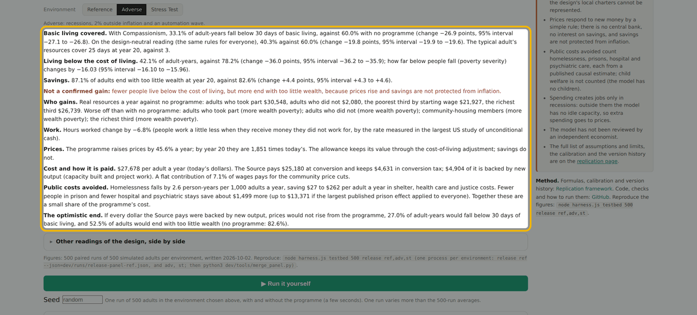

In the Adverse Environment, with recessions and inflation, fewer adults fall below 30 days of basic living: 33.1% against 60.0%. But too little wealth rises from 82.6% to 87.1%.

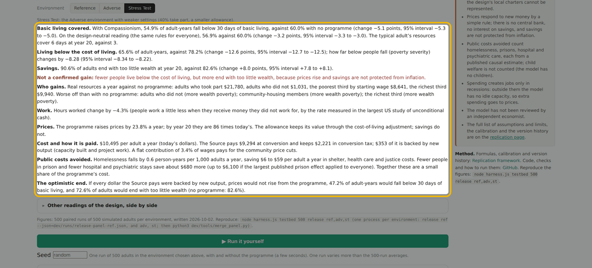

In the Stress Test it is the same: below 30 days of basic living falls from 60.0% to 54.9%, but too little wealth rises from 82.6% to 90.6%. The gain is not confirmed there, and the page says so.

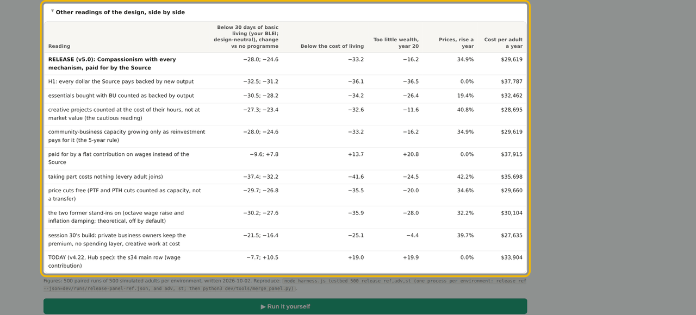

Below the results, other readings of the design sit side by side, including full backing by output, creative work counted at cost, and the earlier engine, so you can see how much each choice matters.

## 4. Run it yourself

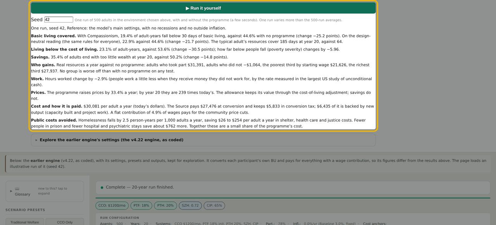

Press Run it yourself to run one seed of 500 adults, with and without the programme, in your browser. A single run varies more than the 500-run averages. Enter a seed to repeat a run exactly: the same seed gives the same result.

## 5. What it cannot tell you

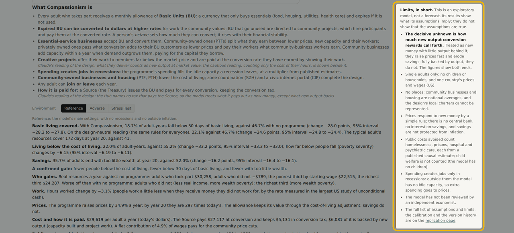

What the model cannot tell you: it has single adults only, no children or households, no places, and a simple rule for prices. It is an exploratory model, not a forecast.

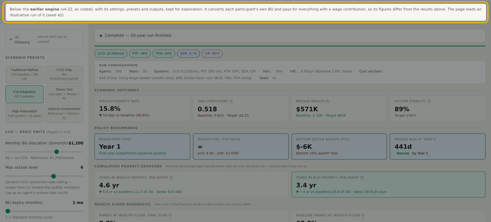

The earlier engine, v4.22, stays below for exploration, with its own settings and presets. Its figures differ from the results above.

## 6. Check the work

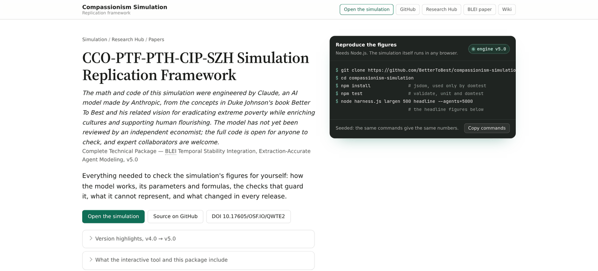

The Replication framework page holds the formulas, the calibration, the assumptions and the full version history.

```
git clone https://github.com/BetterToBest/compassionism-simulation
cd compassionism-simulation && npm install
npm test                              # validate, unit and domtest
node harness.js testbed 500 release ref,adv,st   # the page's figures
```

The simulation is one HTML file. harness.js runs the same engine from the command line; the figures on the page come from node harness.js testbed 500 release ref,adv,st. npm test runs the three checks, validate, unit and domtest, and GitHub runs them on every push.

## 7. Help improve it

Ways to contribute, from [CONTRIBUTING.md](../CONTRIBUTING.md#how-to-contribute): scenario testing (the highest-value contribution), calibration with cited sources, reproducibility testing, model architecture feedback, code, and peer review.

Contributions most wanted: sources for the untested constants, scenario tests from places you know, reproductions, and critiques of the design. Open an issue or a pull request on GitHub. CONTRIBUTING.md explains how.

## Links

- Simulation: https://bettertobest.github.io/compassionism-simulation/
- Code and checks: https://github.com/BetterToBest/compassionism-simulation
- Replication framework: https://bettertobest.github.io/compassionism-simulation/replication.html
- Archive: https://doi.org/10.17605/OSF.IO/QWTE2
